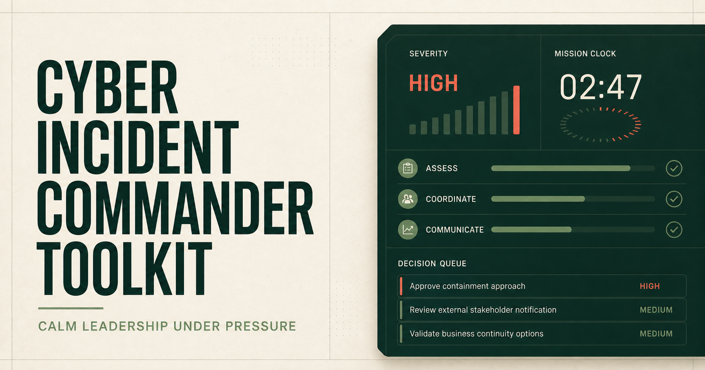

# Cyber Incident Commander Toolkit

[](https://github.com/jessenkurien/cyber-incident-commander-toolkit/actions/workflows/quality.yml)
[](LICENSE)



A practical, leadership-focused toolkit for commanding high-severity cyber incidents with clear decision rights, accountability, and evidence.

This repository combines an interactive incident command workspace with field-ready templates for incident response, digital forensics, executive communications, decision governance, cyber risk management, and post-incident improvement.

> **Purpose:** demonstrate how strong incident leadership connects technical response to business risk—not replace an organization’s approved incident response plan, legal advice, or forensic procedures.

## What this project demonstrates

- Incident command under pressure: objectives, roles, workstreams, decisions, and briefing cadence
- Breach-specific decision rights: what responders may do now, what requires approval, and who accepts business impact
- Executive risk communication that separates confirmed facts, working hypotheses, and unknowns
- Coordination across Security Operations, DFIR, Threat Intelligence, IAM, Cloud, Infrastructure, Legal, Privacy, Communications, and business leadership
- Evidence preservation and decision traceability suitable for audit and after-action review
- Framework-informed validation against NIST CSF 2.0, NIST SP 800-61r3, ISO/IEC 27001 and 27035, with conditional continuity, privacy, financial-services, and payment-card overlays
- Leadership metrics and KRIs that measure outcomes instead of activity volume

## Interactive command center

The browser-based demo includes:

- Four realistic incident scenarios, including a privileged-token compromise in a fictional digital-payments platform
- A live mission clock and severity context
- Interactive containment, forensics, and identity actions
- Workstream progress and local browser persistence
- A decision log with owner and rationale
- A configurable Action Authority Matrix with pre-authorized, approval-required, and executive-risk tiers
- Approval, escalation, accepted-impact, evidence-first, notification, and reassessment records
- Separate technical execution, decision authority, operational risk acceptance, financial risk acceptance, and privacy or regulatory review
- Transparent delegated-limit checks: the payments exercise shows why a projected 30-minute interruption exceeds a fictional 15-minute business-owner limit
- Scenario-level governance results expressed as **valid**, **required**, **gap**, **undetermined**, or **not applicable**—never as a claim of compliance
- An executive status-update generator
- A downloadable incident command pack
- NIST CSF 2.0, NIST SP 800-61r3, ISO/IEC 27001 / 27035, ISO 22301, GDPR, DORA, and PCI DSS v4.0.1 decision support

No production data is sent anywhere. Demo state is stored only in the local browser.

## Command-line rehearsal

The dry-run CLI demonstrates the same leadership problem from a terminal: lower-impact containment continues, a projected service interruption crosses a delegated limit, the decision routes to operational and financial risk owners, governance findings update, and an incident pack is exported.

```bash
pnpm cli scenario
pnpm cli authority
pnpm cli detail
pnpm cli decide --operational "Head of Payments + COO" --financial "CFO"
pnpm cli validate
pnpm cli export
```

Run the complete synthetic workflow with:

```bash
pnpm demo:payments
```

The CLI is a **dry-run rehearsal runner**. It makes no network calls, contains no production adapters, and never executes identity, payment, cloud, endpoint, or containment actions. Its default state remains under the ignored `work/` directory; its incident-pack output remains under the ignored `outputs/` directory.

## Repository map

```text
app/                      Interactive command center
cli/                      Dry-run command-line rehearsal
docs/                     Leadership roles, metrics, and KRIs
examples/                 Completed sample artifacts
frameworks/               Core mappings and conditional governance overlays
playbooks/                Command playbook and tabletop exercise
templates/                Ready-to-copy operational templates
public/                   Social preview asset
```

## Start with the operating model

1. Review the [Incident Command Playbook](playbooks/incident-command-playbook.md).
2. Assign responsibilities using [Roles and RACI](docs/roles-and-raci.md).
3. Configure and approve the [Action Authority Matrix](templates/action-authority-matrix.csv) using the [Decision Rights Operating Model](docs/decision-rights-operating-model.md).
4. Copy the [Incident Action Plan](templates/incident-action-plan.md) for the first operational period.
5. Use the [Decision Log](templates/decision-log.csv) and [Evidence Handling Log](templates/evidence-handling-log.csv) from declaration onward.
6. Brief leaders with the [Executive Status Update](templates/executive-status-update.md).
7. Test decision rights and fallback paths with the [SaaS Token Compromise Tabletop](playbooks/tabletop-saas-token-compromise.md).
8. Walk through operational and financial risk acceptance with the [Digital-Payments Token Compromise Tabletop](playbooks/tabletop-digital-payments-token-compromise.md).
9. Apply the [Governance Validation Overlays](frameworks/governance-validation-overlays.md) only after validating organizational scope and current obligations.
10. Close corrective actions through the [After-Action Review](templates/after-action-review.md).

## Incident command principles

| Principle | Applied behavior |
|---|---|
| One accountable commander | A named leader owns objectives, tradeoffs, cadence, and escalation. |
| Authority before urgency | Responders know what can happen now, what must be approved, and who accepts impact beyond delegated limits. |
| Evidence over assumption | Briefings distinguish facts, hypotheses, and unknowns. |
| Business impact first | Technical findings are translated into operational, customer, financial, legal, and trust impacts. |
| Decisions are durable records | Authority, rationale, evidence, expected outcome, and review trigger are captured. |
| Work in operational periods | Teams align around time-bounded objectives and explicit exit criteria. |
| Recovery requires proof | Technical restoration and business validation both precede closure. |

## Framework alignment

The toolkit maps operational evidence to the six NIST CSF 2.0 functions—Govern, Identify, Protect, Detect, Respond, and Recover—and relevant ISO/IEC 27001:2022 controls. It also uses NIST SP 800-61r3 and ISO/IEC 27035-1:2023 as incident-response references. The digital-payments scenario conditionally surfaces ISO 22301:2019, GDPR, DORA, and PCI DSS v4.0.1 for validation by the appropriate owners.

See the [core framework alignment](frameworks/nist-csf-iso27001-alignment.md) and [governance validation overlays](frameworks/governance-validation-overlays.md).

Framework references are implementation aids, not claims of certification or complete compliance.

## Run locally

Prerequisites: Node.js 22 or newer and pnpm.

```bash
pnpm install
pnpm dev
```

Open `http://localhost:3000`.

Quality checks:

```bash
pnpm test
pnpm lint
pnpm build
```

## Safe use

- Replace all sample content with validated facts before operational use.
- Follow organizational policies, applicable law, contractual obligations, and counsel guidance.
- Do not place secrets, credentials, personal data, regulated data, or sensitive evidence in the demo.
- Preserve original evidence using approved forensic procedures and tooling.
- Treat framework mappings as a starting point for control owners and auditors to validate.
- Treat GDPR, DORA, PCI DSS, notification, and materiality indicators as prompts for qualified Legal, Privacy, Compliance, and contractual review—not automated legal conclusions.
- Treat every authority rule, role, threshold, impact ceiling, and deadline as illustrative until formally approved by the adopting organization.
- The interactive demo records authority outcomes; it does not execute containment or independently grant legal authority.

## Incident leadership series

This project is part of an open-source cyber leadership portfolio:

- **[Cyber Incident Commander Toolkit](https://github.com/jessenkurien/cyber-incident-commander-toolkit)** — coordinates people, objectives, evidence, decisions, and executive communication during a cyber incident.
- **[The 72-Minute Defense](https://github.com/jessenkurien/72-minute-defense)** — defines which containment actions can be pre-authorized and rehearses whether the organization can act before the attacker's clock expires.

Together, they connect incident command with governed, measurable containment.

## Contributing

Constructive improvements are welcome. Please read [CONTRIBUTING.md](CONTRIBUTING.md) and [SECURITY.md](SECURITY.md) before opening an issue or pull request.

## Author

Created by [Jessen Kurien](https://github.com/jessenkurien), a cybersecurity leader focused on incident response, security operations, threat intelligence, cyber risk management, and resilient decision-making.

## License

MIT License. See [LICENSE](LICENSE).
